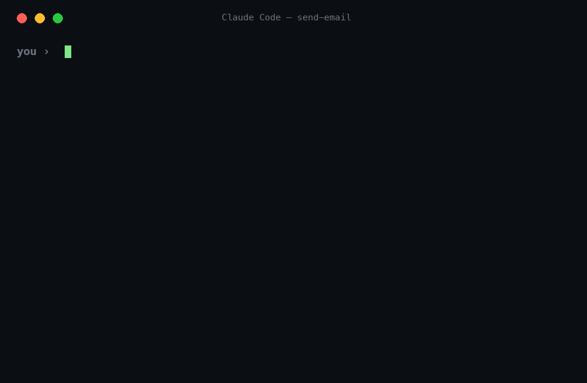
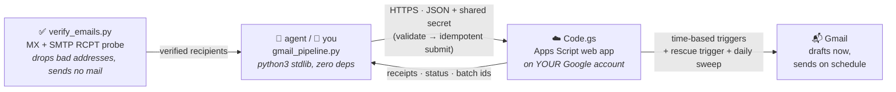

<div align="center">

# 📮 auto-email-sender

### Give your AI agent the power to send email — *without* the power to embarrass you.

**Verify addresses, then send.** Submit a batch, close your laptop — Gmail sends on schedule from **Google's servers**.
Ships as a ready-to-install **Claude Code skill** · doubles as a zero-dependency CLI.

[](https://github.com/genius-harry/auto-email-sender/actions/workflows/ci.yml)
[](LICENSE)
[](gmail_pipeline.py)
[](Code.gs)
[](skills/send-email/SKILL.md)
[](#-how-it-works)



</div>

---

## 🤖 Why hand this to an agent instead of a raw "send email" function?

Because a raw send function + an enthusiastic LLM = a spam incident with your name on it.
Every sharp edge here is padded:

| 😱 Classic agent failure | 🛡️ What happens here instead |
|---|---|
| Retries a timed-out call → **double-sends** | Idempotent `client_key` dedupe — retrying the same command (with an **absolute** `--send-at`; a relative `+10m` resolves to a new time = a new send) can never email anyone twice. Attachments and send-shaping flags are part of the key. |
| Sends `Hi {First Name},` to a real human | Validator **hard-rejects** unfilled placeholders, empty greetings, dup recipients, past times |
| Emails someone you already contacted | `--tracker contacts.csv` makes re-contact a **hard error**, not a silent oops |
| "Sent it!" …without the attachment | CLI verifies the server confirmed **every** attachment; on mismatch it **exits non-zero** with cancel-and-retry steps so unattached drafts never quietly send |
| A recipient fails at draft creation and gets forgotten | Per-recipient failures are written to a `failed-*.json` you can re-submit directly — with a fresh idempotency key, so the retry actually sends |
| Fires without asking | The bundled skill teaches etiquette: **show the text, get an explicit "send it"** |
| No paper trail | Every batch → receipt + batch id → `status` / `cancel` / `send-now` anytime |

## ⚡ How it works



No Gmail "Schedule send" 100-email cap. No third-party email service reading your mail. No daemon on your machine — **the sending happens server-side even if your laptop is in a backpack**.

## 🚀 Install as a Claude Code skill (~5 min)

```bash
git clone https://github.com/genius-harry/auto-email-sender.git
cd auto-email-sender
./install.sh        # → ~/.claude/skills/send-email/  (works from every repo)
```

Do the one-time server setup below, restart Claude Code, and from then on:

> **You:** *"email Sam that the Q3 report is ready, attach q3.xlsx"*
> **Agent:** *writes the batch → validates → submits → "Sent ✅ batch `b07101402_k3x9p`, 1/1 delivered"*

Not on Claude Code? [`skills/send-email/SKILL.md`](skills/send-email/SKILL.md) is a self-contained operating manual any agent framework can load as a tool guide.

<details>
<summary><b>🔧 One-time server setup (click to expand)</b></summary>

1. Generate a secret: `python3 -c "import secrets; print(secrets.token_urlsafe(24))"`
2. [script.google.com](https://script.google.com) (the account you send from) → **New project** → paste all of [`Code.gs`](Code.gs) → save
3. **Project Settings → Script properties** → add `SECRET` = the string from step 1
   *(optional: `SENDER_NAME` display name · `DEFAULT_ATTACHMENT_FILE_ID` a Drive file attached to every email unless a batch passes `--no-default-attach`)*
4. **Services → +** → add **Gmail API**
5. **Deploy → New deployment → Web app** → Execute as **Me** · access **Anyone with the link** → authorize → copy the `/exec` URL
6. Function dropdown → **`installDailySweep`** → **Run** *(daily backstop that re-delivers anything a lost trigger stranded — required, not optional)*
7. Connect + smoke test:
   ```bash
   python3 gmail_pipeline.py init --url '<your /exec URL>'   # prompts for the secret
   python3 gmail_pipeline.py ping                            # → pong ... (server v4)
   # put your own address in test-batch.json, then:
   python3 gmail_pipeline.py submit --batch test-batch.json --send-at '+10m' --no-tracker-check --yes
   ```
</details>

## ⌨️ The hardcore track (humans with terminals)

```bash
# schedule: DST-aware aliases ET/CT/MT/PT · CN · fixed offsets · ISO · '+10m'
python3 gmail_pipeline.py submit --batch batch.json --send-at "2026-07-10 09:00" --tz ET \
    --no-tracker-check --label report-0710 --attach q3-report.xlsx

# send right now
python3 gmail_pipeline.py submit --batch batch.json --send-at '+2m' --no-tracker-check --label hello --yes
python3 gmail_pipeline.py send-now --batch-id <id printed above>

# manage
python3 gmail_pipeline.py status --verbose
python3 gmail_pipeline.py cancel --batch-id <id> --trash-drafts
```

Batch = a JSON list. Bodies are plain text; a **rich-text HTML version is generated automatically** (no hard-wrapped "boxed" look, URLs become links; `--plain` opts out). Per-email `send_at` lets one submit fan out across time zones:

```json
[{"to": "someone@example.com",
  "subject": "Quarterly report",
  "body": "Hi Sam,\n\nAttached is the Q3 report we discussed. The summary tab has the highlights.\n\nBest,\nAlex",
  "send_at": "2026-07-10 09:00 ET"}]
```

## 🧪 Rehearse without sending anything

```bash
python3 mock_server.py 8787    # terminal 1 — full POST contract, in memory
AUTO_EMAIL_CONFIG=/tmp/test.json python3 gmail_pipeline.py init --url http://127.0.0.1:8787/exec --secret testsecret-123
AUTO_EMAIL_CONFIG=/tmp/test.json python3 gmail_pipeline.py submit --batch test-batch.json --send-at '+10m' --no-tracker-check --yes
```

## ✅ Bonus: verify addresses before you send

Bundled `verify_emails.py` pre-flights a recipient list so bad addresses never turn into bounces (which quietly wreck your sender reputation). MX lookup + a live SMTP `RCPT TO` probe + catch-all detection — **no mail is ever sent**, the conversation stops at RCPT then QUITs.

```bash
python3 verify_emails.py --in candidates.json --out verified.json \
    --helo yourdomain.com --probe-from you@yourdomain.com
```

Input is a JSON list of `{"email": "...", "alternates": ["..."]}`; each record comes back with a `verify` verdict — `valid` / `catch_all` / `invalid` / `no_mx` / `unknown` — and when you supply `alternates`, the first address that verifies replaces `email`. Proven-bad records (`invalid` / `no_mx`) are **dropped into `verified.rejects.json`**, so the output file is exactly what you feed into a send batch (`--keep-all` keeps everything annotated in one file instead). (Outbound port 25 is blocked on most home/cloud networks; run it somewhere that can reach it.)

## 📏 Limits & quotas (know before you batch)

- **Gmail daily sending limits apply** — they're your account's, not this tool's. Rough guide: consumer Gmail ≈ 100–150 automated sends/day is the safe zone; Google Workspace goes far higher (≈ 1,500–2,000/day). Spread big campaigns across days with per-email `send_at`.
- **Schedule horizon: 35 days** — the server rejects anything further out.
- **Chunking: ≤30 emails per POST** (the CLI chunks automatically; `--chunk` to tune).
- **Attachments: ≤10 files, ≤20MB raw per batch** — and they're applied to every email in the batch.
- **Idempotency window: 7 days** — dedupe claims and finished batch records are auto-pruned after `DONE_RETENTION_DAYS`, so Script Properties never fill up. A verbatim resubmit more than 7 days later would send again.

## 🧪 Tests

```bash
python -m unittest discover -s tests -v
```

Stdlib-only suite that spins up the mock server and locks down the scary paths: DST-correct time parsing, validator rules, idempotent dedupe, flag-aware keys, attachment confirmation, per-recipient draft-failure recovery, and the recontact guard. Runs in CI on every push.

## 🔒 Security

- Secret lives in Apps Script **Script properties** (server) + `~/.config/auto-email-sender/config.json` chmod `600` (local). **Never in code, never in this repo.**
- URL without the secret → `auth failed`, nothing else.
- Server re-validates recipients (blocks comma-injection multi-recipient tricks) and only reads the default attachment from its own property — never from the request.
- Rotate anytime: change the Script property + re-run `init`. No redeploy.

## 📦 What's in the box

| File | Purpose |
|---|---|
| [`Code.gs`](Code.gs) | ☁️ Server: idempotent intake → drafts w/ attachments → scheduled send + rescue trigger + daily sweep |
| [`gmail_pipeline.py`](gmail_pipeline.py) | ⌨️ CLI: init / ping / validate / submit / status / cancel / send-now / convert |
| [`verify_emails.py`](verify_emails.py) | ✅ Pre-flight verifier: MX + SMTP RCPT probe + catch-all detection, no mail sent |
| [`skills/send-email/SKILL.md`](skills/send-email/SKILL.md) | 🤖 The Claude Code skill: recipe, flag table, copy rules, send-authorization etiquette |
| [`install.sh`](install.sh) | 📥 One command → skill + CLI into `~/.claude/skills/send-email/` |
| [`mock_server.py`](mock_server.py) | 🧪 In-memory fake server for end-to-end rehearsal |
| [`test-batch.json`](test-batch.json) | ✉️ Two-email smoke test (put your own addresses in) |

<div align="center">

**MIT** · hardened by adversarial review · battle-tested on real outbound volume

⭐ *star it if your agent now sends email without embarrassing you*

</div>
